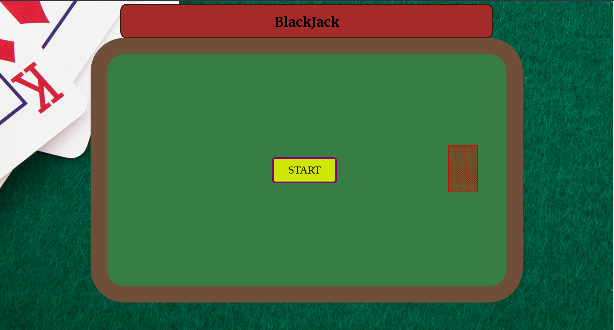
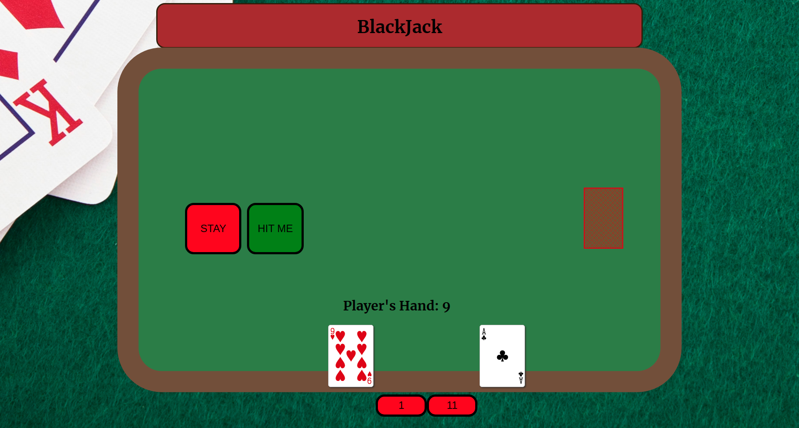
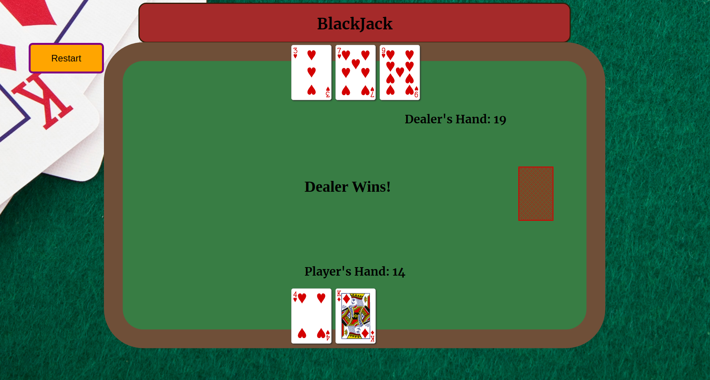
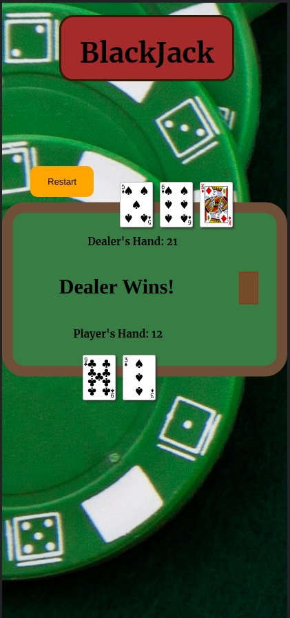

# The Game Of BlackJack

## History Of BlackJack

BlackJack, which can also be known as the game of 21, is a card game that has a long history, but researchers are still uncertain of where the game could have first originated from. The game is most populary played in the casino, where players are betting chips amongst the dealer, and/or other players. Before the game, the table decides on the minimum required bet to proceed with the game. When the game starts, the dealer is dealt to cards, one usually facing up, while the other one is facing down. Player's are dealt two cards each usually facing up, and have the option to either hit, which means to collect another card, or to stay, which means to proceed to the other players or to the dealer. The game objective is to reach a score of 21, or have the closest number to 21, compared to any of the other players on the table. The face values of cards is the same numerical number which is counted towards the player's total. Royal cards, such as Kings, Queen's, and Jack's are valued at 10. (Ex. 10 Hearts + King Of Diamonds = 20). The Ace card is valued either at 11, or 1. It is the player's choice to strategically pick which value they prefer to count onto their total. The Joker is not used in most cases of BlackJack. If player's exceed 21 then they are busted and are out of the round, and in a loss for their money! If the dealer has a card value lower than 17, then the dealer must hit, otherwise if their hand is higher than 17, most cases the dealer must stay.

## Screenshots

### Mobile Support

### Technologies Used
- HTML
- CSS
- JavaScript

## Getting Started 
### Instructions
 When you have clicked the link, just press start to initiate the game! You will automatically be dealt with two cards, and it is your choice to either press the hit button or the stand button! Have fun!

### Next Steps:
The next steps that I would like to take to enhance this project is to create betting chips, so that the user is able to pick how much they would like to bet, and in this case, the dealer would have to match that condition. I would also like to create an animation for the cards that are being dealt towards the players. As well as adding the option for the player to "Double Down", or to "Split". Later, I can possibly add payment methods, so that user's can bet small amounts of money, or even link their crypto wallets!! 

## LINK TO GAME
https://khos7990.github.io/BlackJack-Project/